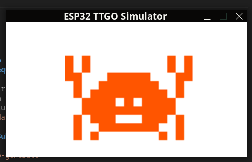
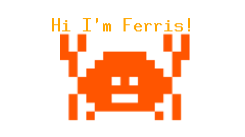

# Exercise [Show Ferris]

Hello 👋, 

In this exercise we will show how you can setup projects which lets you develop for embedded and desktop targets.
For the embedded device we're going to use a TTGO esp32.

First make sure you have followed the environment setup!

Exercise steps:
1. First we're going to do a sanity check.Enter the `./desktop` folder and execute `cargo run` on the command line. This will show you the following:

2. Enter the `./esp32-s1` folder and execute `cargo run`, this will result in en error.
3. Open the `main.rs` in `./esp32-s1/src/` read the **comments** and implement the missing code. 
4. Execute `cargo run` to build and upload your changes to the TTGO esp32 and check your results on your display

BONUS: show a piece of text on both desktop and display by implementing a seond feature in the core-application lib! See comment in `./core-application/src/lib.rs`.

