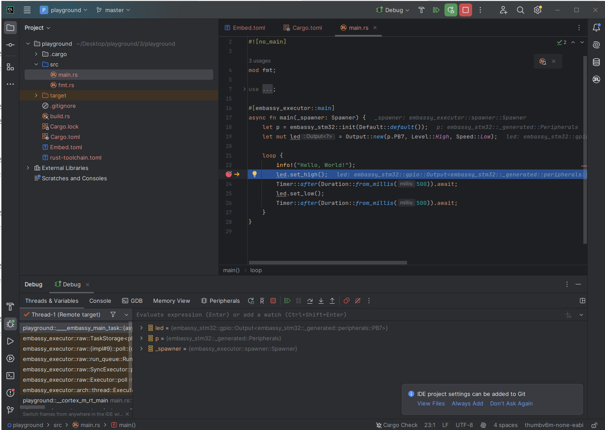

# Starting a Rust project for STM32 microcontrollers with Embassy

This example shows the project that was demo'd during the presentation of the Embedded Rust Playground.

## The script

### You will need

- Clion
- Cargo Embassy
- Probe-rs

Install probe rs
`cargo install probe-rs-tools`

install cargo embassy
`cargo add cargo-embassy`

### Steps

You could create a new embassy project from scratch, the project provides great documentation and lot's of examples.
But there is an easier way.
Keep in mind that all this is still in development and is not perfect. Also, This demo will be using
Clion, but all the tools that will be used can be used in other environments as well.

To make a new project we can use the cargo-embassy tool. It will set up a new hello world/blinky project for us.
This does need the correct chip name, so lets find that out first.

Using probe-rs we can get a list of all the supported chips so far. There is way too many, so we need to use grep.

On my nucleo board there is a nice sticker stating it's the Nucleo-F072RB. So that is what we're going to use

`probe-rs chip list | grep -i f072rb`

This returns the following list:

STM32F072RBHx
STM32F072RBIx
STM32F072RBTx

To see which chip we need, we need to check the actual engraving on the chip itself. In this case it's the STM32F072RBTx
Save this for the next step.

Now we can create a new project with cargo-embassy:

`cargo embassy init playground --chip stm32F072RBTx`

Whithin a few seconds we have our project. But cargo build will not succeed yet. This might be a bug in the cargo-embassy project.
To fix the issue, we need to add this dependency ourselves and to make it easy, just copy the line from one of the embassy examples.

We need to copy line number 9 from here https://github.com/embassy-rs/embassy/blob/main/examples/stm32f0/Cargo.toml
and carefully modify the stm32f091rc chip to match ours. Change it to stm32f072rb.
Also, the examples still use the local embassy install, but in this day and age it's also possible to get the crates from crates.io, so 
the path option can also be removed completely.

The generated project is almost ready now. But, as cargo-embassy did not know we were using a nucleo board, the pin for the LED is wrong.
Change the PB7 pin to PA5 if you are using the nucleo-f072rb board in main.rs at line 19.

Connect the board to the PC using a USB cable and run `cargo run`

The program will now build and flash and the terminal will show hello world prints!

## Part 2: Debugging!

### Needs

- OpenOCD

OpenOCD (Or On Chip Debugger) is a tool which interfaces with various hardware debuggers, such as jtag or st-link.
It acts as a GDB server. allowing developers to use GDB to debug the target device. There is much more, but for now let's continue using it.

### Steps

These steps need to be done inside CLion, with the rust project open.

In the top right of Clion there is now an option to add a configuration:

There, click on edit configurations and add new OpenOCD download & run configuration.

Now, give the new configuration a name. Then, click the gear icon next to Target:
Add a new custom build target.

Name this custom build target and next to the build option, press the `...` option to make a new external tool. Here, add cargo build as tool.

Then hit ok and apply until you're back at the debug configuration screen.
Now change the target to the build target we just made.
Change the executable binary location to point to your executable. This is usually in
`<PROJECT NAME>/target/thumbv6m-none-eabi/debug/<TARGET NAME>` 

Lastly you need to click on assist at the board config file and search for the st_nucleo_f0.cfg (in the case of the f0 microcontroller).
Copy to project and use.

Now hit apply and we're done!

To debug properly though, we need to change two small things in the cargo.toml still.

- Remove `lto = true` from `[profile.dev]`
- Change `opt-level = "z"` to `opt-level = 0` from `[profile.dev]`

Now you must be able to debug the project. Place a breakpoint somewhere and go go go!

## Troubleshooting

There probably will be an error saying optimization level "z" is not supported. 
To solve this you can change the rust-toolchain.toml file.
change the channel to be `channel = "nightly"` on line 4.